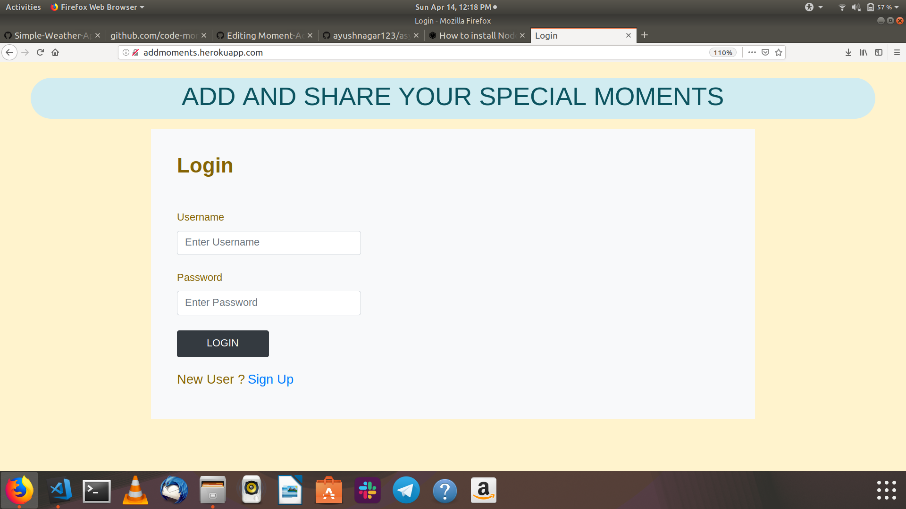
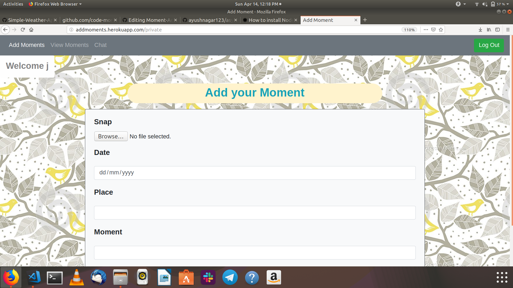
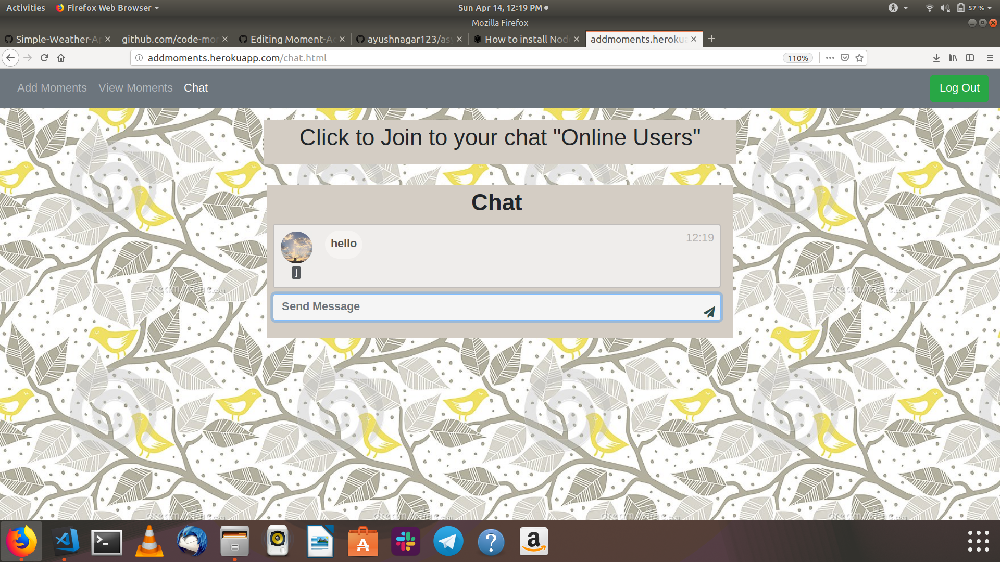

# Moment-Add-Share-Chat 
# [TRY NOW^](https://addmoments.herokuapp.com)

> Web-App to record your special moments and share them with friends and do chat with friends in real time
## How to install in your Linux System
```bash
sudo apt install nodejs npm
git clone https://github.com/sidcoool/Moment-Add-Share-Chat.git
npm install
(install mysql/prosgres and update database details in db.js)
node server.js
```




## Contact

Siddhartha Goel - [Linkedin](https://linkedin.com/in/siddhartha-goel-b2098117a) – siddharthagoel1998@gmail.com
Distributed under the MIT license. See ``LICENSE`` for more information.

[![License][license-image]][license-url]

[license-image]:https://img.shields.io/badge/license-MIT-blue.svg

[license-url]:https://raw.githubusercontent.com/clamytoe/pyTrack/master/LICENSE
